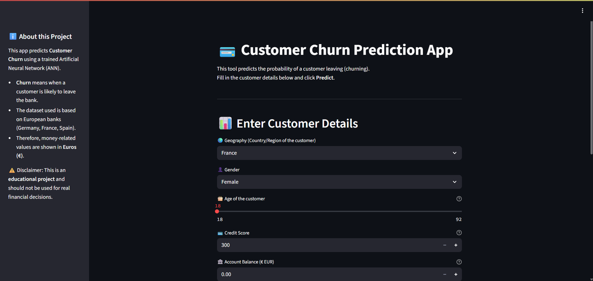

# 🧠 Artificial Neural Network (ANN) - Classification Project  

This project demonstrates the use of an **Artificial Neural Network (ANN)** to solve a classification problem. The model is trained with TensorFlow/Keras and deployed through a simple Streamlit web app.  

---

## 📂 Project Structure  

- **dataset/** → Raw and processed dataset files  
- **encoders/** → Encoders for categorical features  
- **notebook/** → Jupyter Notebooks for experimentation  
- **logs/** → Training logs and outputs  
- **model.h5** → Trained ANN model  
- **prediction.ipynb** → Notebook for testing predictions  
- **app.py** → Streamlit app for deployment  

---

## 📸 Screenshots  

Here’s a preview of the Streamlit app in action:  

## ⚡ Model Training  

The ANN was trained for 100 epochs. Training and validation accuracy stabilized around **86%**, showing that the model generalizes well.  

---

## 🛠️ Tech Stack  

- TensorFlow / Keras – ANN model  
- Pandas, NumPy, Scikit-learn – Data preprocessing    
- Streamlit – Deployment  

---

## 📊 Model Performance  

- Training Accuracy: ~87%  
- Validation Accuracy: ~86%  
- Validation Loss: ~0.34  

---

## ✨ Features  

- Clean, modular codebase  
- Encoders for categorical variables  
- Pre-trained model file (`model.h5`)  
- Web interface with Streamlit  
- Training logs included  

---

## 🙌 Credits  

Developed with ❤️ by **Subhankit Banerjee** 

